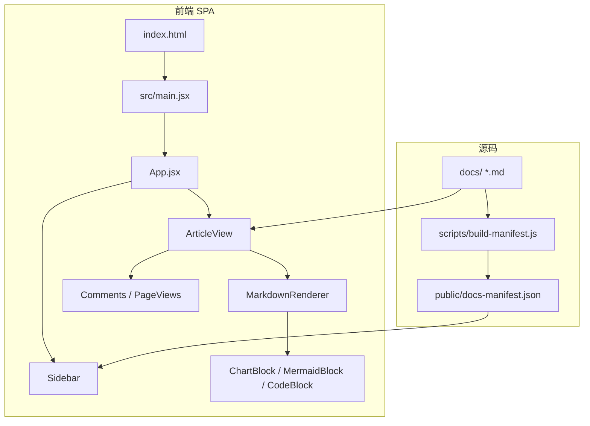
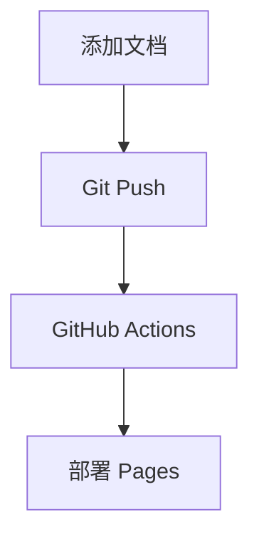

随着 AI 编程工具的日益成熟，对于我们个人而言，只要拥有一个想法，将其变为项目和产品的难度已经大大降低。无论是否有编程经验，我们每个人都可以扮演产品经理、全栈开发等角色。最近，我正好有一个想法，想和大家分享下我从想法到项目的完整经历。


## 项目背景

最近公司毫无征兆地裁掉了一部分同事，所以我打算重启刷面试题的计划。一方面是为了巩固基础知识，另一方面也希望能以面试题为切入点，了解和学习一些 AI 相关的知识。

基于这个目的，我发现单纯看面经很容易忘记，也达不到预期的效果。如果通过编码或写文档的方式走一遍，效果可能会更好。然而，常规的 Markdown 编辑器或在线文档功能有限，有的数据保存在本地无法同步，有的功能不全，有的无法分享，还有的不能与他人交流。

因此，一个可以免费部署到公网、支持多设备共享、便于与他人交流、并且可以个性化定制的项目变得十分必要。这正是我今天要介绍的这个项目的由来。

## 项目信息及效果

- **项目 GitHub 地址**：[https://github.io/xiuji008/xjdoc-interview](https://xiuji008.github.io/xjdoc-interview/)

- **GitHub Pages 部署后的 Web 地址**：[https://xiuji008.github.io/xjdoc-interview/](https://xiuji008.github.io/xjdoc-interview/)

- **项目文档地址**：[https://xiuji008.github.io/xjdoc-interview/#/docs/README](https://xiuji008.github.io/xjdoc-interview/#/docs/README)


**首页、文档结构树、顶部栏**


**阅读数、分类、标签、介绍**


**评论**


**提示**


**sequence**


**chart图表**


## 项目开发工具

- **开发 AI 工具**：CodeBuddy CN

## 开发流程

- 第一步：创建文件夹

创建一个项目目录，并使用 CodeBuddy CN 打开。

-  第二步：确认方案

打开 CodeBuddy CN 对话框，我使用的是 `Craft` 模式，模型选择 `Deepseek-V4-Flash`，并输入以下内容：

```
基于以下文档先设计方案及技术选型，设计完成后找我确认，确认完成后在进行开发

## 项目背景

将面试相关的文档分类整理后放在一个目录中：

docs/
├── java/
│   ├── java基础/ 
│   │   ├── collection.md
│   ├── cli/       
│   └── web/       
├── ai/
│   ├── skills/      
│   ├── db/        
│   └── shared/    
├── README.md
├── CONTRIBUTING.md

现在我想做一个 Node 项目，需实现以下功能：

1. 按文件目录生成左侧文档结构树；
2. 每添加一篇 md 文件，通过 GitHub Pages 部署后可在页面查看；
3. 每篇文章头部都添加 YAML Front Matter，并据此在每篇文章头部渲染出一块区域，展示如 title、tags、category、slug 等配置信息；
4. Markdown 中包含 ```mathjax!、```sequence、```mermaid! 等语法的代码块，也需要支持渲染；
5. 基于 GitHub 实现评论功能（如果可以，希望增加阅读数统计）。
```

-  第三步：生成代码，根据具体情况进行多轮对话调整

在对话框中选择技术选型及设计方案，确认后会进行代码生成。生成之后，根据实际效果进行多轮对话修正。

-  第四步：推送到 GitHub，进行环境变量等一系列配置

-  第五步：调试 GitHub Pages 构建，并查看页面

-  第六步：让工具总结，生成 README

至此，整个项目完成了从想法到开发再到部署的全流程。

## 项目耗时

这个想法萌生于早上通勤的路上。到公司后，我便利用工作间隙开始了尝试。整个开发过程完全交给 AI，我只需要清晰地描述需求，并在它生成代码后进行验证和对话调整。

到下午下班时，项目已基本成型。晚上回家后，我又集中花了约 3 个小时进行细节调优、多轮对话修正以及 GitHub Pages 的部署配置。

**总计耗时**：白天零散的“摸鱼时间” + 晚上集中的 3 小时。从想法到可公网访问的完整项目上线，实际投入的净时间不到一天。


## 项目说明

以下将对项目的系统架构、核心功能、使用方法及部署方式做详细说明。

### 面试知识库 📖

面试文档知识库系统，支持自动扫描 Markdown 文档、渲染图表/公式/流程图，通过 GitHub Pages 一键部署。

---

#### 一、系统架构



**技术栈：**

| 层 | 技术 | 用途 |
|---|------|------|
| 构建 | Vite 5 | 开发服务器 + 生产构建 |
| UI 框架 | React 18 | SPA 页面组件 |
| 路由 | react-router-dom 6 | HashRouter 页面切换 |
| Markdown | react-markdown 9 | 核心渲染引擎 |
| 数学公式 | KaTeX + remark-math + rehype-katex | LaTeX 公式渲染 |
| 图表 | Recharts | 饼图、柱状图、折线图等 |
| 流程图 | Mermaid | 流程图、时序图、状态图 |
| 文档扫描 | gray-matter (Node) | 构建时提取 YAML Front Matter |
| 部署 | GitHub Actions | 自动构建并部署到 Pages |

---

#### 二、全部功能及用法

##### 2.1 左侧文档树

构建时自动扫描 `docs/` 目录生成文档树，按目录层级展示。支持展开/折叠和搜索。

**效果：** 页面加载后左侧显示文件树

```
📂 java
  📂 java基础
    📚 collection
  📂 cli
  📂 web
📂 ai
  📂 skills
    🤖 机器学习基础
📄 README
📄 CONTRIBUTING
```

**用法：** 只要在 `docs/` 下放 `.md` 文件，构建时自动收录

---

##### 2.2 YAML Front Matter 卡片

每篇 `.md` 文件头部用 `---` 包裹的元信息，渲染为蓝色主题卡片。

**效果：**

```
╔═══════════════════════════════════════════╗
║  📚 Java集合框架详解                       ║
║  分类: Java/Java基础  📅 2024-01-15       ║
║  [Java] [集合] [面试]                      ║
║  全面梳理 Java 集合框架核心知识点...        ║
╚═══════════════════════════════════════════╝
```

**写法：**

```yaml
---
title: Java集合框架详解
tags: [Java, 集合, 面试]
category: Java/Java基础
slug: java/java基础/collection
emoji: 📚
description: 完整的中文描述
created: 2024-01-15
updated: 2024-03-20
---
```

---

##### 2.3 数学公式（KaTeX）

支持行内公式和块级公式。

**效果：**

行内：$E = mc^2$

块级：
$$
\int_{-\infty}^{\infty} e^{-x^2} \, dx = \sqrt{\pi}
$$

**写法：**

```markdown
行内公式：$E = mc^2$

块级公式：
$$
\int_{-\infty}^{\infty} e^{-x^2} \, dx = \sqrt{\pi}
$$
```

也支持 mathjax 代码块：

````markdown
```mathjax
f(x) = \sum_{i=1}^{n} i^2
```
````

---

##### 2.4 图表（Recharts）

支持 `pie`、`bar`、`line`、`area`、`radar` 五种图表。

**效果：** 彩色可交互图表，鼠标悬停显示数据

**写法：**

````markdown
```chart
{
  "type": "pie",
  "title": "技术栈分布",
  "data": [
    { "name": "Java", "value": 40 },
    { "name": "Python", "value": 25 },
    { "name": "前端", "value": 20 }
  ]
}
```
````

各图表类型：

| 类型 | 说明 | 关键字段 |
|------|------|---------|
| `pie` | 饼图/环形图 | `angleField`, `colorField` |
| `bar` | 柱状图 | `xField`, `yField` |
| `line` | 折线图 | `xField`, `yField` |
| `area` | 面积图 | `xField`, `yField` |
| `radar` | 雷达图 | `xField`, `yField` |

---

##### 2.5 流程图/时序图（Mermaid）

**效果：**



**写法：**

````markdown

````

时序图：

````markdown
```sequence
participant A as 客户端
participant B as 服务端
A->>B: 请求
B-->>A: 响应
```
````

支持所有 Mermaid 类型：

| 类型 | 代码块语言 | 说明 |
|------|-----------|------|
| 流程图 | `mermaid` | `graph TD / LR / BT` |
| 时序图 | `sequence` | `sequenceDiagram` |
| 饼图 | `mermaid` | 内置 `pie` 语法 |
| 类图 | `mermaid` | `classDiagram` |
| 甘特图 | `mermaid` | `gantt` |
| 状态图 | `mermaid` | `stateDiagram` |

---

##### 2.6 代码块 + 复制按钮

所有代码块自动添加语言标签和复制按钮。

**效果：**

```
┌─ java ──────────────────── 📋 复制 ─┐
│                                     │
│  public class Hello {               │
│      public static void main(..)    │
│  }                                  │
│                                     │
└─────────────────────────────────────┘
```

点击复制按钮 → 自动复制到剪贴板，按钮变为 ✅ 已复制（1.8 秒后恢复）。

**写法：**

````markdown
```java
public class Hello {
    public static void main(String[] args) {}
}
```
````

不写语言也自动渲染为代码块：

````markdown
```
纯文本代码块
```
````

---

##### 2.7 GitHub Alert 提示

5 种颜色不同的警报提示块。

**效果：**

> [!NOTE]
> 蓝色提示，用于补充信息

> [!TIP]
> 绿色提示，用于小技巧

> [!IMPORTANT]
> 紫色提示，用于重要信息

> [!WARNING]
> 橙色提示，用于警告

> [!CAUTION]
> 红色提示，用于谨慎操作

**写法：**

```markdown
> [!NOTE]
> 提示内容写在这里
```

| 类型 | 颜色 | 适用场景 |
|------|------|---------|
| NOTE | 蓝 | 补充信息 |
| TIP | 绿 | 实用技巧 |
| IMPORTANT | 紫 | 关键信息 |
| WARNING | 橙 | 注意提醒 |
| CAUTION | 红 | 风险警告 |

---

##### 2.8 表格（Pipe Table）

标准 GFM 表格语法。

**效果：** 带边框的格式化表格

| 算法 | 类型 | 优点 |
|------|------|------|
| 线性回归 | 回归 | 简单 |
| 决策树 | 分类 | 可视化 |

**写法：**

```markdown
| 算法 | 类型 | 优点 |
|------|------|------|
| 线性回归 | 回归 | 简单 |
| 决策树 | 分类 | 可视化 |
```

---

##### 2.9 阅读量统计

基于 GitHub Gist API 的跨设备阅读量计数器。

**效果：** 文章头部显示 👁️ N（每次浏览 +1）

**启用步骤：**

**① 创建 Gist**  
访问 [gist.github.com](https://gist.github.com) → 右上角 **+** → New gist：
- 文件名：`counts.json`
- 内容：`{}`
- 选 **Create secret gist**
- 创建后 URL 形如 `https://gist.github.com/xiuji008/abc123`，复制 Gist ID（最后一段 `abc123`）

**② 生成 Token**  
访问 [GitHub Settings → Tokens (classic)](https://github.com/settings/tokens) → Generate new token：
- 只勾选 **gist** 权限
- 生成后复制 Token

**③ 填入配置**

```js
// src/utils/gistCounter.js
const GIST_ID = '你的GistID'
const GIST_TOKEN = 'ghp_xxxx （仅 gist 权限，不影响代码仓库）'
```

> ⚠️ Token 会打包到前端 JS，务必只勾选 `gist` 权限，定期更换更安全。

---

##### 2.10 评论系统（giscus）

基于 GitHub Discussions 的评论区，无需 OAuth App，无 token 泄露风险。

**效果：** 文章底部展示 GitHub 风格的评论区，每篇文章独立讨论

**启用步骤：**

1. 仓库 Settings → Features → 勾选 **Discussions**
2. 访问 [giscus App](https://github.com/apps/giscus) → Install → 选本仓库
3. 访问 [giscus.app](https://giscus.app/zh-CN) 填入 `xiuji008/xjdoc-interview` 获取 ID
4. 将 `repoId`、`categoryId` 填入：

```js
// src/components/Comments.jsx
const GISCUS_CONFIG = {
  repo: 'xiuji008/xjdoc-interview',
  repoId: 'R_kgDOSoPcRg',
  category: 'Announcements',
  categoryId: 'DIC_kwDOSoPcRs4C94wU',
}
```

- 使用 `data-mapping="specific"` + `data-term={slug}` 按文章独立分页
- 支持 GitHub Reactions（👍❤️🎉 等）

---

#### 三、项目目录结构

```
xjdoc-interview/
├── docs/                           # 📁 文档源文件
│   ├── java/
│   │   ├── java基础/collection.md
│   │   ├── cli/
│   │   └── web/
│   ├── ai/
│   │   ├── skills/
│   │   ├── db/
│   │   └── shared/
│   ├── README.md
│   └── CONTRIBUTING.md
├── public/
│   ├── _config.yml                 # GitHub Pages 配置
│   └── docs-manifest.json          # 构建时自动生成的文档清单
├── scripts/
│   └── build-manifest.js           # 扫描 docs/ 生成 manifest
├── src/
│   ├── main.jsx                    # React 入口
│   ├── App.jsx                     # 路由 + 布局
│   ├── App.css                     # 全局样式
│   ├── components/
│   │   ├── Sidebar.jsx             # 左侧文档树
│   │   ├── ArticleView.jsx         # 文章详情页
│   │   ├── ArticleHeader.jsx       # Front Matter 卡片
│   │   ├── MarkdownRenderer.jsx    # 统一渲染管线
│   │   ├── MermaidBlock.jsx        # Mermaid 图渲染
│   │   ├── ChartBlock.jsx          # Recharts 图表渲染
│   │   ├── CodeBlock (内联)        # 代码块 + 复制按钮
│   │   ├── PageViews.jsx           # 阅读量统计
│   │   ├── Comments.jsx            # giscus 评论
│   │   └── ErrorBoundary.jsx       # 错误边界
│   ├── hooks/
│   │   ├── useDocManifest.js       # 加载文档清单
│   │   └── useDocContent.js        # 加载 .md + 解析 Front Matter
│   └── utils/
│       └── gistCounter.js          # GitHub Gist 计数器
├── .github/workflows/deploy.yml    # GitHub Actions 自动部署
├── worker-counter.js               # Cloudflare Worker 备用方案
├── vite.config.js
├── package.json
└── index.html
```

---

#### 四、快速开始

```bash
# 1. 安装依赖
npm install

# 2. 生成文档清单 + 启动开发服务器
npm run dev

# 3. 打开浏览器访问
open http://localhost:5173

# 4. 构建生产版本
npm run build
```

---

#### 五、部署

推送 `main` 分支到 GitHub 后，`.github/workflows/deploy.yml` 自动执行：

1. `npm ci` — 安装依赖
2. `npm run build` — 生成 manifest + 构建 SPA
3. 部署到 GitHub Pages

> 需要在仓库 Settings > Pages 中设置 Source 为 **GitHub Actions**。

---

#### 六、添加新文档

```yaml
---
title: 文档标题
tags: [标签1, 标签2]
category: 分类/子分类
slug: 路径/文件名（唯一标识）
emoji: 📝
description: 简短描述
---
```

将 `.md` 文件放入 `docs/` 下对应目录 → 提交推送 → 自动部署上线。

## 写在最后

需要特别说明的是，这个项目只是一个知识载体，真正有价值的，是其中沉淀的内容。工具帮你降低了表达的门槛，但坚持每天更新知识内容、在使用中持续优化项目，才是这件事能否走远的关键。

AI 不会替代开发者，但它正在重新定义“开发者”的门槛。以前，一个想法到产品之间，隔着厚厚的编程语法、框架选型、环境配置等障碍。而现在，AI 像一位 7x24 小时在线的资深搭档，帮你把这些“脏活累活”快速落地。

**重要的不再是你掌握多少语法，而是你是否有清晰的逻辑、能否准确地描述需求，以及是否愿意把自己的想法付诸实践。**

希望我的这次分享能给你带来一些启发。如果你也有一个酝酿已久的想法，不妨现在就打开一个 AI 工具，让它帮你迈出第一步。