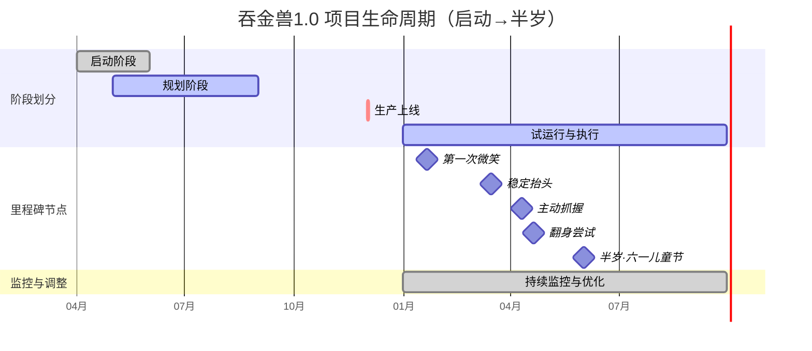

> 项目经理是我媳妇，我是那个会冲奶粉、偶尔换尿布、认真认错的员工001
>
> 谨以此文，送给娃人生第一个儿童节，也送给真正的项目总指挥
>
> 📅 2026年6月1日 · 六一儿童节 | 👶 项目产品月龄：半岁 | 🏷️ #养育即项目 #半岁里程碑

---

今天是六一儿童节，也是我家娃来到这个世界后**第一个属于自己的节日**。

娃现在半岁左右：会笑、会抓东西、会努力翻身。他还不会说话，但已经成功把我们这个原本“松耦合”的两人家庭，重构为一个**强矩阵、全天候运转的项目管理组织**。

项目经理是我媳妇。我是员工001，负责冲奶粉、换尿布、认真认错。

这篇文章，就当是给娃的第一个儿童节交作业。也郑重表个态：**项目经理辛苦了。今天是娃的节日，但真正该被庆祝的人，是你。**

---

## 一、启动阶段：一个项目的诞生

某天，项目经理（我搭子）拿着一个显示“两道杠”的小棒从卫生间走出来。

那一瞬间，脑子里闪过很多东西。有兴奋，有紧张，有那种“真的要来了”的不真实感。但事后回想起来，那一刻最核心的事情其实特别简单——**确认方向，然后立项**。

✅ **关键动作**：确认值得做 → 项目立项

💡 **项目管理启示**：启动阶段的本质从来不是“万事俱备”，而是“确认方向”。很多人在启动阶段就卡住了，觉得得等条件完美、预算充足、心理准备好。别想了。养娃教会我的第一课就是——**没有真正准备好的时候**。方向一旦确认，剩下的就是在路上解决。

---

## 二、规划阶段：项目上线前的准备

从确认怀孕到孩子出生，整整九个月。产检医院、月嫂安排、婴儿用品清单、家庭分工、预算估算……我跟你说，那段时间我媳妇做的Excel表格比我的工作计划还细。

但规划得再细，也永远觉得不够细。

我印象很深，预产期前一周，我俩坐在沙发上对清单。对到最后项目经理说了一句：“行吧，就这样了，能想到的都想完了。”语气里既有释然，也有一点点心虚。

后来我才明白：**规划的意义从来不是消除所有不确定性，而是让自己心里有底。** 你知道大概要花多少钱、大概需要哪些东西、大概谁负责什么。剩下的，到时候再说。

---

## 三、执行阶段：项目正式上线

孩子出生的那一刻，项目从“开发环境”正式切换到“生产环境”。

一声啼哭，系统开机。所有参与者同时进入高负载状态。

说真的，那一刻你才知道什么叫高负载。不分白天黑夜，按需响应。娃哭了，你得判断他为什么哭——饿了？困了？热了？还是单纯想被抱？需求完全不明确，但你必须马上给出响应。

项目经理7×24小时在线决策，员工001负责换尿布、拍嗝、冲奶粉、跑腿。

最开始那两周，我是真的懵。你能想象吗，一个以前可以睡到自然醒的人，突然变成两小时醒一次。不是闹钟叫醒，是娃叫醒。而且每次醒来你都得做点什么，不是醒了就完事了。

💡 **执行阶段的核心能力不是“控制”，而是“响应”。** 你控制不了他什么时候醒、什么时候饿、什么时候哭。你只能在他需要你的时候，第一时间出现。

---

## 四、监控阶段：随时调整，随时优化

养娃的监控阶段，是每时每刻都在发生的事情。

睡眠规律什么时候开始出现的，喂养量什么时候该加、什么时候该减，谁负责夜班谁负责白天——这些就是典型的进度监控、质量监控和资源调配。

但监控的意义不是挑错。

是你发现娃今天睡得比昨天好了一点，你会觉得项目在往前跑。是你发现娃开始对你笑了，你会觉得这个项目有正向反馈了。是你发现项目经理今天终于睡了个整觉，你会觉得——嗯，资源调配终于对了。

💡 **监控是为了让项目运行得更丝滑。**

---

## 五、里程碑：每一个“第一次”都是节点

半年来，我们走过的里程碑不多，但每一个都记得特别清楚。

- **第一次微笑**：不是那种喝完奶无意识的嘴角上扬，是真的对着你笑了。我当时就愣住了，抱着娃在客厅站了得有十秒钟。
- **第一次抬头**：趴着的时候脖子突然有劲儿了，小脑袋晃晃悠悠地撑起来，我跟项目经理在旁边疯狂拍照，搞得像什么重大科研突破。
- **第一次抓住玩具**：目标是爸爸的眼镜。从那以后我戴眼镜都得躲着点。
- **第一次翻身**：现在还不太利索，偶尔需要助攻。但每次他自己翻过去，脸上那个表情，像完成了一个人生KPI。
- **第一次发出“yi ~ ya ~”的声音**：虽然还不是“爸爸”，但我已经单方面宣布他在叫我了。

而今天——**六一儿童节，是娃人生的第一个儿童节**。

这个里程碑很特别。它不属于任何功能性节点，不是“学会了什么”，不是“做到了什么”。它只属于**庆祝这个项目存在的意义**。

> 🌟 好的项目，不仅关注交付，也关注值得庆祝的时刻。

---

### 📇 半岁里程碑纪念卡

    
🌟 半岁里程碑 🌟

    
项目代号：吞金兽1.0

    
里程碑日期：2026年6月1日 · 项目产品月龄：半岁

    

    
<strong>✅ 已上线功能</strong>

    

        ✔ 第一次微笑 ✔ 稳定抬头
        ✔ 主动抓握 ✔ 社交微笑
        🔄 翻身（进行中） 📢 咿呀发声
    

    
<strong>📅 下一阶段预告</strong>

    

        独立坐立
        爬行
        出牙
        添加辅食
        叫“爸爸/妈妈”
    

    

        
<strong>📝 项目经理寄语</strong>

        
“半岁只是一个开始。希望你慢慢长大，但不要太快离开我们。希望你学会很多本事，但永远记得被爱的感觉。” —— 项目经理·妈妈

    

    

        🛠️ 员工001签名：修己xj
        📅 2026.6.1
    

---

## 六、当前状态：半岁，系统运行平稳

### 产品能力状态

| 能力 | 状态 | 备注 |
|------|------|------|
| 抬头 | ✅ 稳定 | 脖子有劲儿了 |
| 翻身 | 🔄 进行中 | 偶尔需要助攻 |
| 抓握 | ✅ 熟练 | 目标：爸爸的眼镜 |
| 社交微笑 | ✅ 上线 | 会主动对人笑 |
| 整觉 | 📅 规划中 | 预计1岁后迭代 |

### 团队角色状态

| 角色 | 当前状态 | 评价 |
|------|----------|------|
| 项目经理（妈妈） | 全天候在岗 | 项目的灵魂与核心 |
| 员工001（爸爸） | 积极执行中 | 态度端正，眼力见儿不断提升 |
| 外部顾问（双方父母） | 按需支援 | 关键资源池 |

> 一个项目能顺利走完半岁，从来不是一个人的功劳，而是一个系统的胜利。

我有时候觉得，养娃这件事最妙的隐喻就在这里：你以为你是在养一个孩子，但其实你是在跟一群人一起，运转一个极其复杂的系统。每个人都有自己的角色，每个人都在调整自己的节奏。而项目经理，是让这个系统不散架的那个人。

---

## 附：项目生命周期甘特图

---

## 七、下一阶段：规划与期待（半岁→1岁）

**即将上线的功能**：独立坐立、爬行、出牙、添加辅食、真正意义上的“爸爸/妈妈”发音。

**项目方向变化**：从“被动照护”向“主动探索”过渡，从纯奶喂养向辅食+奶过渡。

我跟你说，光是想到他第一次叫“爸爸”这件事，我现在就开始紧张了。

> 💡 好的项目，永远在“刚刚完成”和“即将开始”之间。

---

## 写在最后

项目经理辛苦了。真的。

那些半夜起来喂奶的时刻，那些娃哭了她比谁都先醒的时刻，那些明明很累了还要查资料研究辅奶粉要不要换、尿不湿哪个好的时刻，我都看在眼里。

今天是娃的节日，但我想把这份庆祝，分一半给你。

---

### 🎈 员工001 · 六一承诺书

- ✅ 绝不说“带娃不累吧”
- ✅ 主动带娃让PM刷手机
- ✅ 娃哭第一个冲过去
- ✅ 今晚夜班我包了

---

> 🌱 半岁只是一个开始，下一迭代更精彩。
>
> 希望你慢慢长大，但不要太快离开我们。
>
> 希望你学会很多本事，但永远记得被爱的感觉。

**—— 员工001 · 修己xj**

**📅 2026年6月1日 · 六一儿童节**

---

📸 项目组合影

